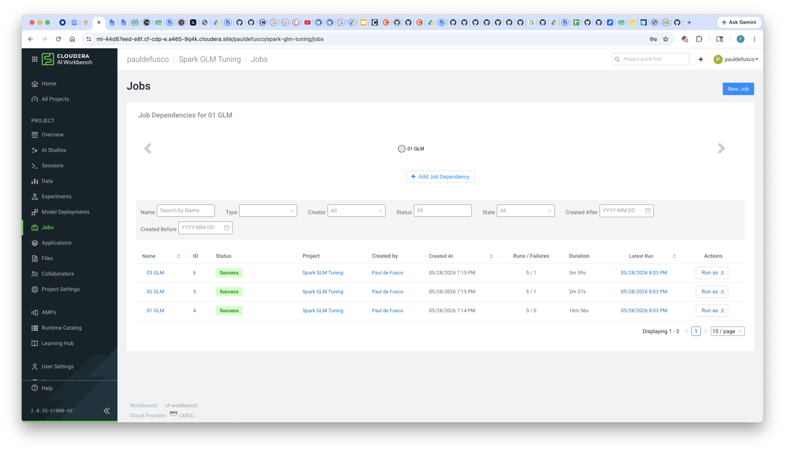
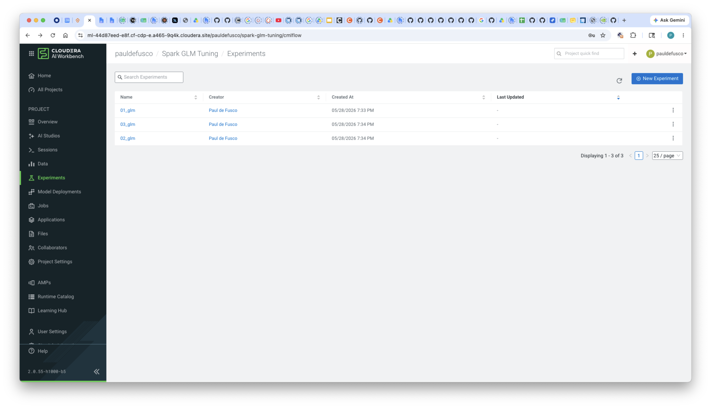
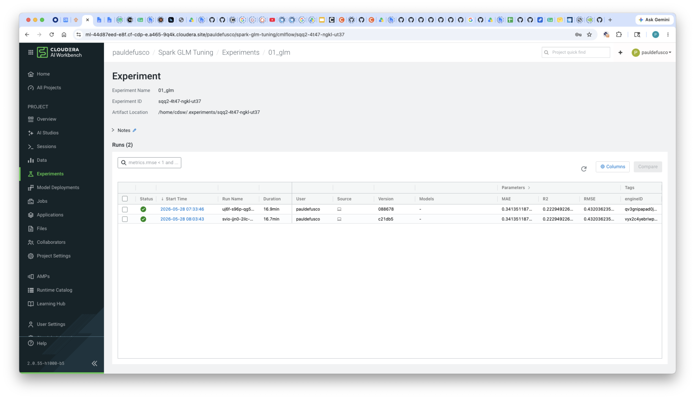
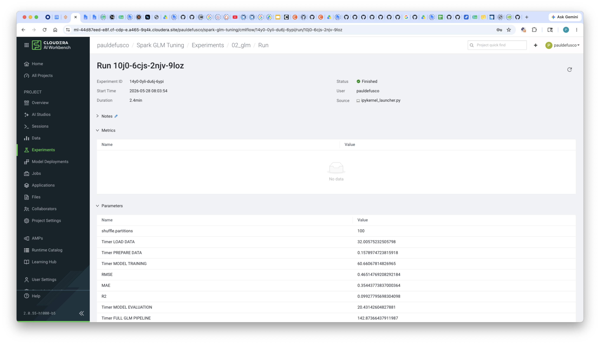

# CAI Spark GLM

This project evaluated multiple approaches for benchmarking and tuning the performance in a Spark-based Poisson GLM pipeline in Cloudera AI using CAI Expeirments, CAI Jobs, and Spark on Kubernetes runtime features.

## Scripts Evaluated

### 1. `01_glm`

**Approach:**

* `StringIndexer`
* `OneHotEncoder`

**Result:**

```text
Poisson GLM Training Complete
[TIMER END] FULL GLM PIPELINE -> 979.82 seconds
```

This baseline implementation used traditional categorical encoding with one-hot vectors. While functionally correct, the pipeline incurred significant overhead due to the large sparse feature space generated by one-hot encoding.

---

### 2. `02_glm`

**Approach:**

* `StringIndexer`
* Removed `OneHotEncoder`

**Result:**

```text
Poisson GLM Training Complete
[TIMER END] FULL GLM PIPELINE -> 135.17 seconds
```

Removing one-hot encoding dramatically reduced runtime and pipeline complexity. This represented the largest optimization improvement observed during testing.

---

### 3. `03_glm`

**Approach:**

* Feature Hashing

**Result:**

```text
Training complete.
[TIMER END] FULL GLM PIPELINE -> 210.67 seconds
```

Feature hashing reduced feature engineering complexity and avoided explicit categorical expansion. Performance improved substantially compared to the baseline, though runtime was slightly higher than the simplified indexed-only approach.

---

# Performance Comparison

| Script   | Feature Strategy              | Runtime (seconds) |
| -------- | ----------------------------- | ----------------: |
| `01_glm` | StringIndexer + OneHotEncoder |            979.82 |
| `02_glm` | StringIndexer Only            |            135.17 |
| `03_glm` | Feature Hashing               |            210.67 |

---

# Experiment Tracking

All experiments were tracked using:

* MLflow
* Cloudera AI Experiments

This allowed centralized tracking of:

* Runtime metrics
* Model parameters
* Training configurations
* Experiment comparisons

---










# Further Optimization Opportunities

Additional optimizations can be explored by running each pipeline as an independent Spark job and tuning environment-specific Spark configurations.

Examples include:

* `spark.sql.shuffle.partitions`
* Executor memory
* Dynamic allocation settings
* Parallelism configurations

For these experiments, shuffle partitions were configured to:

```text
spark.sql.shuffle.partitions = 100
```

Further tuning may improve both training time and resource utilization depending on dataset size and cluster configuration.
